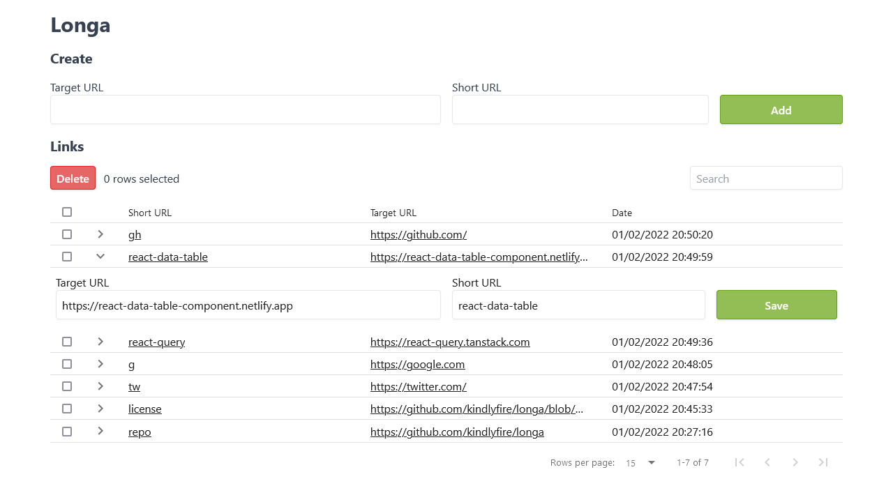

# Longa

_("long" in Esperanto)_

Simple, small single-user URL shortener app built with Go + an admin interface in
React.



## Configuration

App will read from `config.toml`, `config.json` or `config.yaml`. Check out
`config.example.toml` for default values. Env variables take priority if
present.

| Config file option | Env var           | Description                         |
| ------------------ | ----------------- | ----------------------------------- |
| `database_uri`     | `L_DATABASE_URI`  | Database URI (SQLite only)          |
| `listen_addr`      | `L_LISTEN_ADDR`   | Port the web server will listen on  |
| `home_redirect`    | `L_HOME_REDIRECT` | Where the `/` route redirects to    |
| `username`         | `L_USERNAME`      | Username for API and dashboard auth |
| `password`         | `L_PASSWORD`      | Password for API and dashboard auth |

## Accessing dashboard

The dashboard is accessible at `<app endpoint>/_/`.

## Building from source

Requires: Go 1.17, GCC (for sqlite), NodeJS, Yarn

```sh
# In the root directory of the project
cd frontend
yarn
yarn build
cd ..
go build
```

This should output an executable named `longa.exe` on Windows or `longa`
everywhere else.
